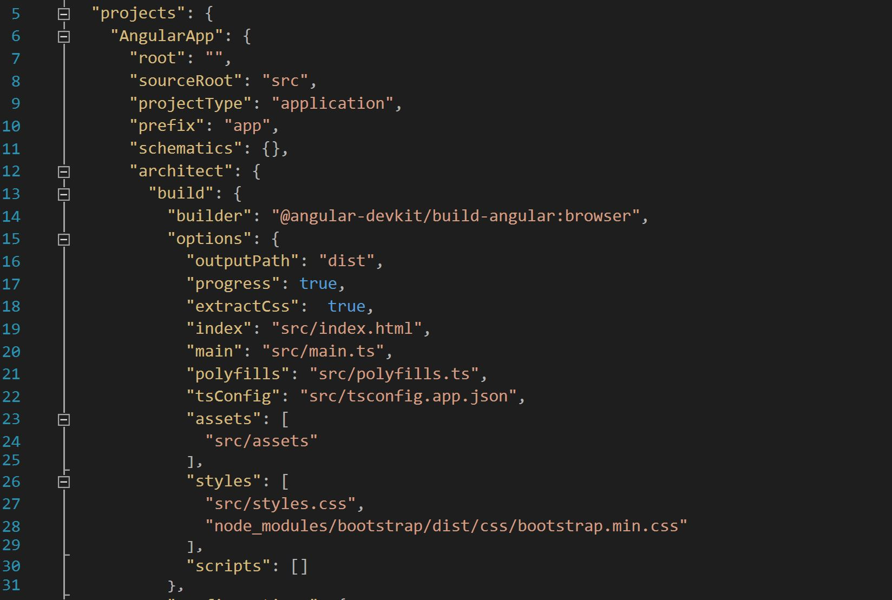
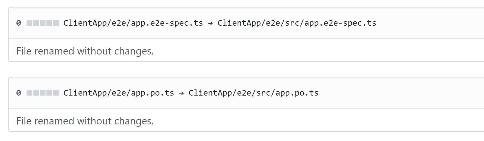
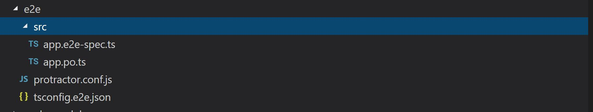

With the release of [Angular 6](https://angular.io) just few days ago I have decided that today I will spend some time to upgrade my [angular-aspnetcore app](https://github.com/rynsantos/angular-aspnetcore).
Basically the application is my take on the [tour of heroes](https://angular.io/tutorial) tutorial that is hosted inside ASP.NET Core.

The framework I used here is called JavaScriptServices it is a set of client-side technologies for ASP.NET Core.

For more information about Microsoft JavascriptServices framework see https://github.com/aspnet/JavaScriptServices

#### Install angular cli
1. Install the latest Angular cli - requires nodejs v8.9 or higher
~~~
npm install -g @angular/cli
~~~

2. Create a new angular app - just give you an idea of what are things that's added/changed in angular 6 the most common is the angular.json file.
~~~
ng new AngularApp
~~~

3. Copy angular.json file - this is going to be the default angular.json file for the app
~~~
Copy:  AngularApp > angular.json  
Paste: angular-aspnetcore > ClientApp folder
~~~

4. Delete `.angular-cli.json` from angular-aspnetcore > ClientApp

#### Edit angular.json file
- Add lines 16, 17, 17 & 28

#### Changes to test structure
Since I'm following the default angular.json file structure I have to rearrange the test files inside my app.

#### karma test modifications
~~~
1. Move the karma.conf.js file inside ClientApp/src folder
2. Open karma.conf.js and replace @angular/cli with @angular-devkit/build-angular
~~~
#### e2e test modifications
1. Create a new src folder inside e2e and move the following files

2. After creating src folder in previous step the e2e structure should now look like this 

#### Rxjs modifications
In my services component when consuming my backend API's I make it asynchronous using [rxjs](http://reactivex.io/rxjs) observables.
Now all I have to do is to change how I import the library.
~~~
Change 'rxjs/Observable' to just 'rxjs'
~~~

#### Run the test
- cd into the ClientApp folder
~~~
cd ClientApp
~~~
- Run linters
~~~
ng lint
~~~
- Run Karma test
~~~
ng test
~~~
- Run protractor test
~~~
ng e2e
~~~

#### Publish to production
- cd into the project root
~~~
cd angular-aspnetcore
~~~
- Publish the app
~~~
dotnet publish -o publish -c Release 
~~~
- cd into the publish folder
~~~
cd publish
~~~
- Run the app
~~~
dotnet angular_aspnetcore.dll
~~~

That's it all done! my app is now utilising the angular6 goodness.
